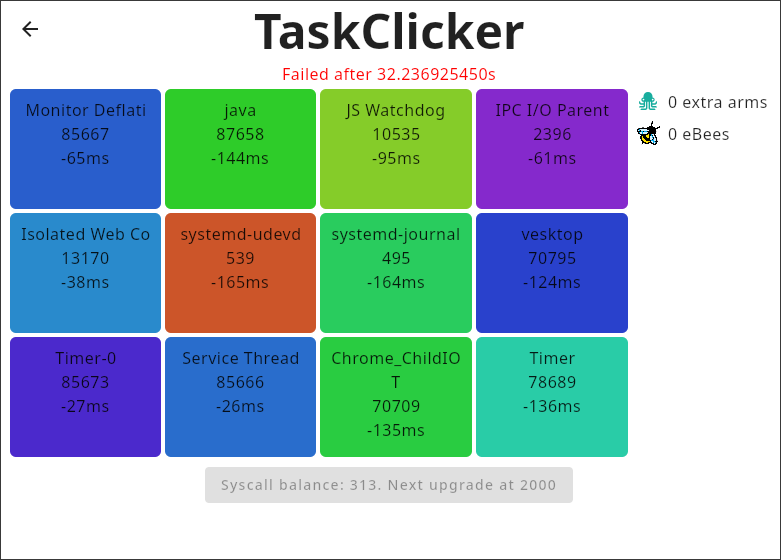

# Fun Schedulers

sched_ext makes writing weird and creative schedulers surprisingly accessible. Here are
some schedulers built with hello-ebpf that show just how far you can take it.

---

## Sound Scheduler

**Blog:** [Part 20 — A Scheduler Controlled by Sound](https://mostlynerdless.de/blog/2025/03/25/hello-ebpf-a-scheduler-controlled-by-sound-20/)  
**Talk:** [Sound of Scheduling — Chemnitz Linux Days 2025](https://speakerdeck.com/parttimenerd/sound-of-scheduling-writing-linux-schedulers-in-java-with-ebpf)  
**Source:** [github.com/parttimenerd/loudness-scheduler](https://github.com/parttimenerd/loudness-scheduler)

<iframe width="560" height="315" src="https://www.youtube.com/embed/ihAGd8GN90w" title="Sound of Scheduling — Writing Linux Schedulers in Java with eBPF" frameborder="0" allow="accelerometer; autoplay; clipboard-write; encrypted-media; gyroscope; picture-in-picture" allowfullscreen></iframe>

Shout at your computer to make it run faster. The scheduler reads the microphone every
100 ms and scales the number of active CPU cores with loudness. Louder room → more cores
allocated; library quiet → CPU cores are throttled. The idea came from Andrea Righi
during [OSPM 2025](https://lpc.events/event/25/contributions/1960/).

### How it works

The BPF half is a FIFO scheduler with two `GlobalVariable` knobs the Java side updates
continuously:

```java
@BPF(license = "GPL")
@Property(name = "sched_name", value = "loudness_scheduler")
public abstract class FIFOScheduler extends BPFProgram implements Scheduler {
    final GlobalVariable<Integer> cores = new GlobalVariable<>(
            Runtime.getRuntime().availableProcessors());
    final GlobalVariable<Integer> sliceNs = new GlobalVariable<>(-1);
```

`selectCPU` round-robins tasks across the active core count:

```java
@Override
public int selectCPU(Ptr<task_struct> p, int prev_cpu, long wake_flags) {
    if (!bpf_cpumask_full(p.val().cpus_ptr)) {
        return bpf_cpumask_first(p.val().cpus_ptr);
    }
    return (@Unsigned int) (prev_cpu + 1) % cores.get();
}
```

`enqueue` shrinks each task's slice proportionally to queue depth — louder input means
more cores, shorter per-task slice, higher throughput:

```java
@Override
public void enqueue(Ptr<task_struct> p, long enq_flags) {
    var slice = sliceNs.get() == -1 ? 5_000_000 : sliceNs.get();
    var scaledSlice = (@Unsigned int) slice / scx_bpf_dsq_nr_queued(SHARED_DSQ_ID);
    scx_bpf_dispatch(p, SHARED_DSQ_ID, scaledSlice, enq_flags);
}
```

The Java main loop samples the microphone and pushes updated values every 100 ms —
changes take effect in the kernel in under 100 ms, with no restart needed.

### Bonus: frequency-controlled time slices

Pass `--frequency 440` to scale each task's time slice by the dominant frequency in the
microphone input. Calibrate mode shows you what the scheduler sees:

```
> ./scheduler.sh --calibrate --frequency 440
Loudness:  0.0 -> cores:  1, top frequency:    -1 -> slice 147.0ms
Loudness:  7.0 -> cores:  8, top frequency:    23 -> slice 139.0ms
```

### What it demonstrates

| Component | Role |
|-----------|------|
| `@BPF` + `@BPFFunction` | The scheduler's BPF callbacks |
| `GlobalVariable<Integer>` | `cores` and `sliceNs` — written by Java, read in BPF |
| `SchedulerBase` + `DispatchQueue` | FIFO foundation |
| Java main loop | Polls microphone, updates globals |

The interesting part is not the scheduler algorithm — it's that the **scheduling policy
is controlled by a Java thread reading a microphone**, with changes taking effect in under
100 ms, all without a kernel patch.

### Running it

```bash
git clone https://github.com/parttimenerd/loudness-scheduler
cd loudness-scheduler
mvn package
sudo java -jar target/loudness-scheduler.jar
```

Requires a microphone (or any ALSA input device) and Linux ≥ 6.14 with sched_ext enabled.

---

## Taskclicker

**Source:** [github.com/Mr-Pine/taskclicker](https://github.com/Mr-Pine/taskclicker)  
**Submitted to:** [sched-ext-kit-contest](https://github.com/parttimenerd/sched-ext-kit-contest)

Taskclicker is a Linux CPU scheduler where **you are the scheduler.** A GUI shows you all
runnable tasks; you click a task to dispatch it to a CPU.

> "Well… As I'm writing this, I'm not sure if this is what I was supposed to build when
> they tasked me with writing a fcfs scheduler for gaming with focus on interactivity… But
> well, it exists now, for better or for worse so have fun."
> — Mr-Pine, README



Can you keep your system fully interactive before the 30-second task timer runs out?
(Spoiler: the README was written with Taskclicker running.)

Written in Kotlin (69 %) + Java (31 %), it wires hello-ebpf's sched_ext support into a
desktop game. Build and run:

```bash
xhost si:localuser:root
sudo ./gradlew run
```

---

## Your scheduler here?

If you build something interesting with hello-ebpf sched_ext support, open a PR or file
an issue to add it to this page.

---

*[Back to Overview](index.md)*
