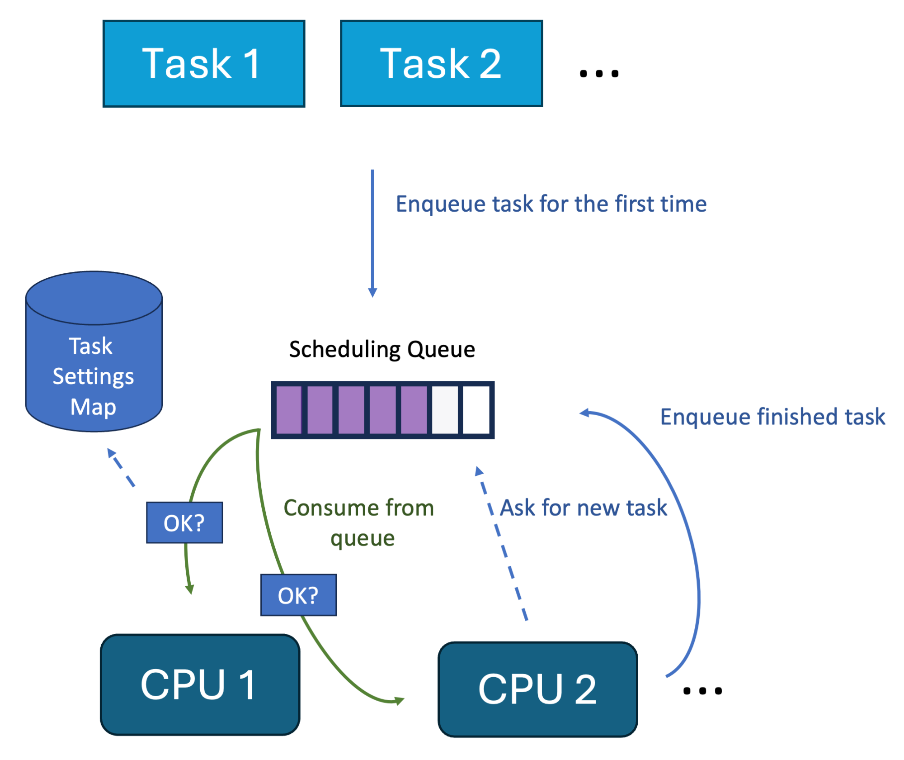

# sched_ext — Overview

**Kernel docs:** [docs.kernel.org/scheduler/sched-ext.html](https://docs.kernel.org/scheduler/sched-ext.html) · **BPF program type:** [BPF_PROG_TYPE_STRUCT_OPS/sched_ext_ops](https://docs.ebpf.io/linux/program-type/BPF_PROG_TYPE_STRUCT_OPS/sched_ext_ops/)  
**Blog series:** [Part 15 — Write a custom scheduler in Java](https://mostlynerdless.de/blog/2024/09/10/hello-ebpf-writing-a-linux-scheduler-in-java-with-ebpf-15/) · [Part 16 — Userspace scheduler](https://mostlynerdless.de/blog/2024/12/03/hello-ebpf-control-task-scheduling-with-a-custom-scheduler-written-in-java-16/) · [Part 17 — Lottery scheduler](https://mostlynerdless.de/blog/2024/12/17/hello-ebpf-writing-a-lottery-scheduler-in-java-with-sched-ext-17/) · [Part 18 — bpf_for_each](https://mostlynerdless.de/blog/2024/12/27/hello-ebpf-writing-a-lottery-scheduler-in-pure-java-with-bpf-for-each-support-18/)  
**Source:** [`SchedulerBase.java`](https://github.com/parttimenerd/hello-ebpf/blob/main/bpf/src/main/java/me/bechberger/ebpf/bpf/SchedulerBase.java) · [`Scheduler.java`](https://github.com/parttimenerd/hello-ebpf/blob/main/bpf/src/main/java/me/bechberger/ebpf/bpf/Scheduler.java)

It all started when I was naive enough to propose a talk at the eBPF Summit on writing
Linux schedulers in Java — then I had to implement it. The result turned out to be
genuinely useful: hello-ebpf can now replace the Linux CPU scheduler with pure Java code,
all as a normal jar file, with no kernel patching required.

<iframe width="560" height="315" src="https://www.youtube.com/embed/bWs5GHYpYxg" title="Writing a Linux Scheduler in Java with eBPF — eBPF Summit 2024" frameborder="0" allow="accelerometer; autoplay; clipboard-write; encrypted-media; gyroscope; picture-in-picture" allowfullscreen></iframe>

sched_ext is a Linux scheduling class introduced in kernel 6.11 that lets you implement
CPU schedulers entirely in BPF. Instead of patching the kernel, you can prototype and
deploy custom scheduling policies from a user-space Java program.

## Prerequisites

- Kernel ≥ 6.14 with `CONFIG_SCHED_CLASS_EXT=y`
- Verify: `ls /sys/kernel/sched_ext` should exist
- At most one sched_ext scheduler can be active at a time — stop any running scx service
  with `systemctl stop scx` before attaching your own.

## Why sched_ext?

Traditional kernel schedulers require kernel patches, reboots, and deep kernel expertise.
sched_ext lets you:

- Prototype scheduling algorithms in minutes
- Deploy different schedulers per workload
- Roll back instantly if a scheduler misbehaves (watchdog auto-detaches in `timeout_ms`)
- Ship schedulers as ordinary jar files
- Use the full JVM ecosystem — data structures, profiling, third-party libraries — in your scheduling policy



## Quick start

The minimal requirement is two annotations and one method:

```java
import me.bechberger.ebpf.annotations.bpf.BPF;
import me.bechberger.ebpf.annotations.bpf.Property;
import me.bechberger.ebpf.bpf.BPFProgram;
import me.bechberger.ebpf.bpf.Scheduler;
import me.bechberger.ebpf.bpf.SchedulerBase;
import me.bechberger.ebpf.bpf.sched.DispatchQueue;
import me.bechberger.ebpf.bpf.sched.EnqFlags;
import me.bechberger.ebpf.type.Ptr;
import static me.bechberger.ebpf.runtime.TaskDefinitions.task_struct;

@BPF(license = "GPL")
@Property(name = "sched_name", value = "my_scheduler")
public abstract class MyScheduler extends SchedulerBase implements Scheduler {

    // Attach to the shared DSQ created by SchedulerBase.init() — no extra create needed.
    final DispatchQueue shared = DispatchQueue.attach(SHARED_DSQ_ID);

    @Override
    public void enqueue(Ptr<task_struct> p, long enq_flags) {
        shared.insertScaled(p, EnqFlags.passThrough(enq_flags));
    }

    public static void main(String[] args) throws Exception {
        try (var sched = BPFProgram.load(MyScheduler.class)) {
            sched.runSchedulerLoop();   // attach + block until Ctrl-C
        }
    }
}
```

`SchedulerBase` provides:
- A pre-created shared DSQ at `SHARED_DSQ_ID = 0`
- A default `init()` that creates that DSQ
- A default `dispatch()` that moves tasks from the shared DSQ to the local CPU queue
- A default `exit()` that captures the exit code for `getExitCode()`

You only need to override `enqueue()`.

## Loading and running

```java
// Attach and block until the user presses Ctrl-C:
try (var sched = BPFProgram.load(MyScheduler.class)) {
    sched.runSchedulerLoop();
}
// Closing the program atomically restores the previous scheduler.

// Or manual lifecycle (useful for tests):
try (var sched = BPFProgram.load(MyScheduler.class)) {
    sched.attachScheduler();
    System.out.println(sched.isSchedulerAttachedProperly()); // true
    Thread.sleep(5000);
}  // detaches on close
```

Check attachment status (e.g. verify watchdog hasn't fired):

```java
sched.isSchedulerAttachedProperly()          // reads /sys/kernel/sched_ext/root/ops
sched.waitWhileSchedulerIsAttachedProperly() // blocks until detached
```

> **Danger — scheduler bugs can hang the system**
>
> If `enqueue()` never inserts a task, or `dispatch()` never consumes one, tasks starve
> and the system may become unresponsive. Always test in a VM first (e.g. via `vng`).
> The `timeout_ms` watchdog auto-detaches a misbehaving scheduler, but only after the
> timeout elapses — during which the system may be sluggish.

The diagram below shows how dispatching works across the kernel and userspace scheduler paths:


---

*Next: [Writing a Scheduler](guide.md)*
