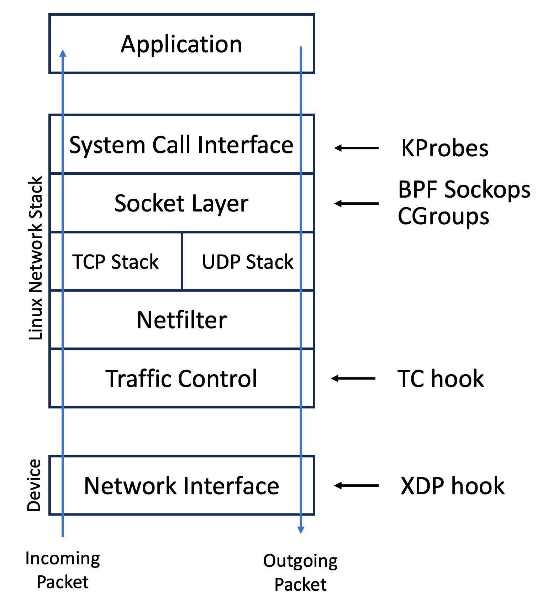

# TC — Traffic Control Classifier

**Blog series:** [Part 13 — Packet logger with TC and XDP hooks](https://mostlynerdless.de/blog/2024/08/13/hello-ebpf-a-packet-logger-in-pure-java-using-tc-and-xdp-hooks-13/) · [Part 14 — Firewall with Java & eBPF](https://mostlynerdless.de/blog/2024/08/27/hello-ebpf-building-a-lightning-fast-firewall-with-java-ebpf-14/)
**Javadoc:** [`TCHook`](https://parttimenerd.github.io/hello-ebpf/javadoc/bpf/me/bechberger/ebpf/bpf/TCHook.html)
**Source:** [`TCHook.java`](https://github.com/parttimenerd/hello-ebpf/blob/main/bpf/src/main/java/me/bechberger/ebpf/bpf/TCHook.java)
**See also:** [XDP Hook](xdp.md) · [BPF Maps](maps.md) · [LSM & Cgroup](lsm.md)



TC (Traffic Control) hooks let you inspect and modify packets at the Linux TC subsystem layer.
Unlike XDP which runs in the driver, TC programs operate on full `sk_buff` (socket buffer) objects,
giving you access to more metadata and the ability to modify packet contents after the kernel has
already parsed them.

## When to use TC

- You need both ingress **and** egress hooks (XDP is ingress-only)
- You need to access socket metadata (`__sk_buff` fields like `mark`, `priority`)
- You want to modify packet contents (TC can rewrite headers)
- The NIC driver doesn't support XDP native mode
- You need to attach to virtual interfaces (veth, loopback)

## Implementing TCHook

```java
import me.bechberger.ebpf.annotations.bpf.BPF;
import me.bechberger.ebpf.annotations.bpf.BPFFunction;
import me.bechberger.ebpf.bpf.BPFProgram;
import me.bechberger.ebpf.bpf.TCContext;
import me.bechberger.ebpf.bpf.TCHook;
import static me.bechberger.ebpf.runtime.SkDefinitions.__sk_action;

@BPF(license = "GPL")
public abstract class MyTCProg extends BPFProgram implements TCHook {

    @Override
    @BPFFunction
    public __sk_action tcHandleIngress(TCContext skb) {
        return __sk_action.__SK_PASS;
    }

    @Override
    @BPFFunction
    public __sk_action tcHandleEgress(TCContext skb) {
        return __sk_action.__SK_PASS;
    }
}
```

You can implement one or both of `tcHandleIngress` and `tcHandleEgress`. The compiler plugin
generates `SEC("tc/ingress")` and `SEC("tc/egress")` sections respectively.

## The `__sk_buff` context

| Field | Type | Description |
|-------|------|-------------|
| `len` | `int` | Total packet length |
| `pkt_type` | `int` | Packet type (PACKET_HOST, PACKET_BROADCAST, …) |
| `mark` | `int` | Packet mark (fwmark) — read/write |
| `queue_mapping` | `int` | Queue mapping |
| `protocol` | `int` | L3 protocol (ETH_P_IP, ETH_P_IPV6, …) |
| `vlan_present` | `int` | Whether VLAN tag is present |
| `vlan_tci` | `int` | VLAN TCI if present |
| `priority` | `int` | TC priority — read/write |
| `ingress_ifindex` | `int` | Ingress interface index |
| `ifindex` | `int` | Current interface index |
| `data` | `int` | Start of packet data |
| `data_end` | `int` | End of packet data |

## Return values

| Constant | Meaning |
|----------|---------|
| `__sk_action.__SK_PASS` (= `TC_ACT_OK`) | Accept packet, continue processing |
| `__sk_action.__SK_DROP` (= `TC_ACT_SHOT`) | Drop packet |
| `TC_ACT_UNSPEC` | Use default action |
| `TC_ACT_PIPE` | Pass to next filter in chain |
| `TC_ACT_REDIRECT` | Redirect to another interface |

## Attaching the program

```java
public static void main(String[] args) throws Exception {
    try (MyTCProg prog = BPFProgram.load(MyTCProg.class)) {
        // Attach ingress to all non-loopback interfaces
        prog.tcAttachIngress();

        // Or attach egress to all interfaces
        prog.tcAttachEgress();

        // Or attach to a specific interface by ifindex (from `ip link`)
        // prog.tcAttachIngress(ifindex);
        // prog.tcAttachEgress(ifindex);

        System.out.println("TC program attached. Ctrl-C to stop.");
        Thread.currentThread().join();
    }
    // Detached automatically on close()
}
```

## Example — rate-limit by packet mark

```java
@BPF(license = "GPL")
public abstract class MarkHeavyFlows extends BPFProgram implements TCHook {

    @BPFMapDefinition(maxEntries = 1024)
    final BPFHashMap<Integer, Long> bytesPerSrc = BPFHashMap.newInstance();

    final GlobalVariable<Long> threshold = new GlobalVariable<>(1_000_000L);

    @Override
    @BPFFunction
    public __sk_action tcHandleIngress(Ptr<__sk_buff> skb) {
        int src = skb.val().protocol;   // simplified — use actual IP src in production
        Ptr<Long> bytes = bytesPerSrc.bpf_get(src);
        long current;
        if (bytes == null) {
            current = skb.val().len;
        } else {
            current = bytes.val() + skb.val().len;
        }
        bytesPerSrc.bpf_put(src, current);

        if (current > threshold.get()) {
            // Mark the packet; tc/iptables rules can act on this
            Ptr.of(skb.val().mark).set(1);
        }
        return __sk_action.__SK_PASS;
    }

    @Override
    @BPFFunction
    public __sk_action tcHandleEgress(Ptr<__sk_buff> skb) {
        return __sk_action.__SK_PASS;
    }
}
```

## Modifying packet data

TC programs can call `bpf_skb_store_bytes` and `bpf_l3_csum_replace` / `bpf_l4_csum_replace`
to rewrite headers in-place. These are raw BPF helpers available via `BPFHelpers` (not `BPFJ`).
Always recalculate checksums after modifying IP or TCP/UDP fields:

```java
@BPFFunction
void rewriteDstPort(Ptr<__sk_buff> skb, int offset, short newPort) {
    // bpf_skb_store_bytes is a raw BPF helper — use BPFHelpers.bpf_skb_store_bytes(...)
    BPFHelpers.bpf_skb_store_bytes(skb, offset, Ptr.of(newPort), 2, BPF_F_RECOMPUTE_CSUM);
}
```

## TC vs XDP comparison

| Aspect | XDP | TC |
|--------|-----|----|
| Hook location | Driver (pre-SKB) | After SKB allocation |
| Egress hook | No | Yes |
| Modify packet | Limited | Full |
| Overhead | Lowest | Low |
| Virtual interfaces | Limited | Yes |
| Kernel minimum | 4.8 | 4.1 |

---

## Examples

- [`TCDropEveryThirdOutgoingPacket.java`](https://github.com/parttimenerd/hello-ebpf/blob/main/bpf-samples/src/main/java/me/bechberger/ebpf/samples/TCDropEveryThirdOutgoingPacket.java) — drop every third egress packet
- [`PacketLogger.java`](https://github.com/parttimenerd/hello-ebpf/blob/main/bpf-samples/src/main/java/me/bechberger/ebpf/samples/PacketLogger.java) — log packets via TC + ring buffer

---

## Further reading

- [TC BPF program type — docs.ebpf.io](https://docs.ebpf.io/linux/program-type/BPF_PROG_TYPE_SCHED_CLS/)
- [TC actions — docs.ebpf.io](https://docs.ebpf.io/linux/program-type/BPF_PROG_TYPE_SCHED_CLS/#return-values)
- [XDP Hook](xdp.md) · [BPF Maps](maps.md) · [LSM & Cgroup](lsm.md)
